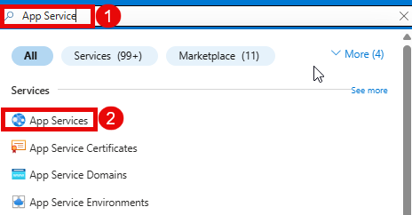
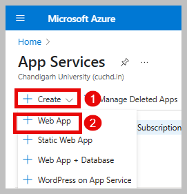
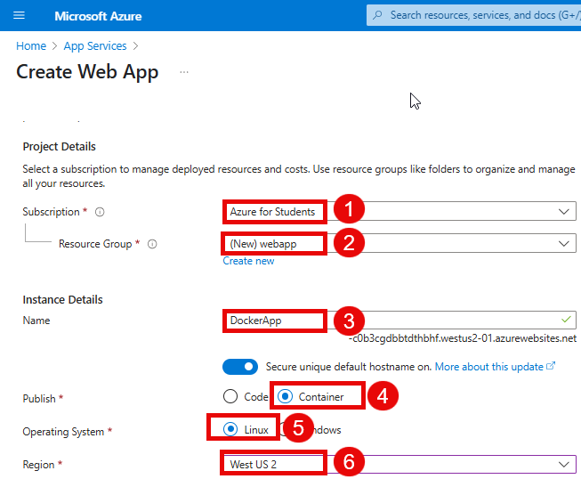
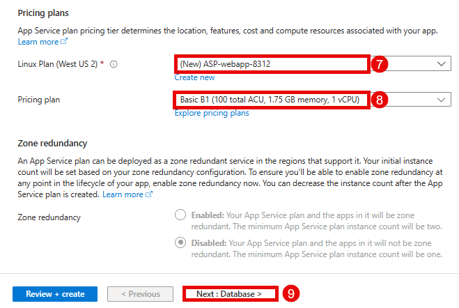
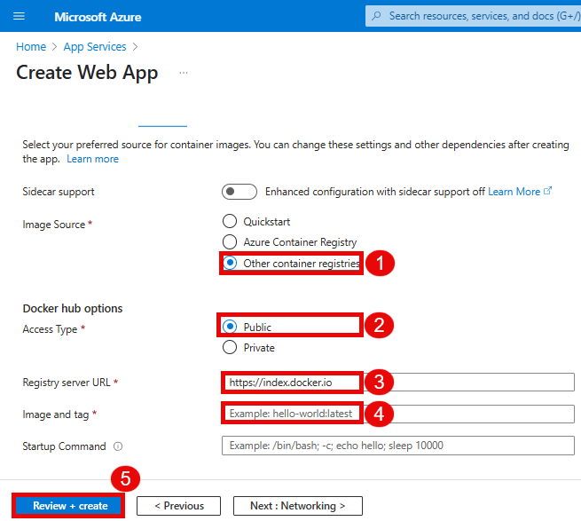
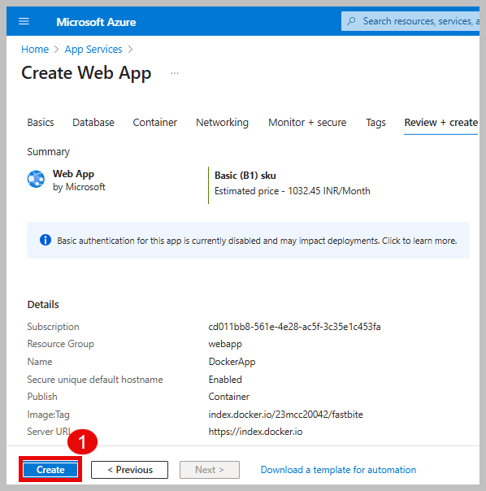
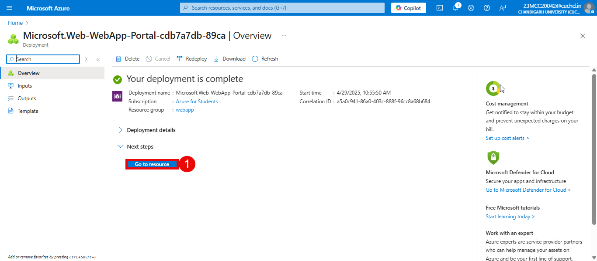
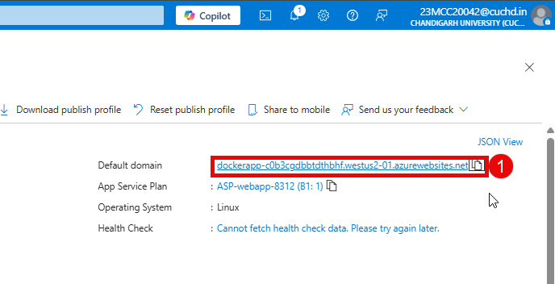
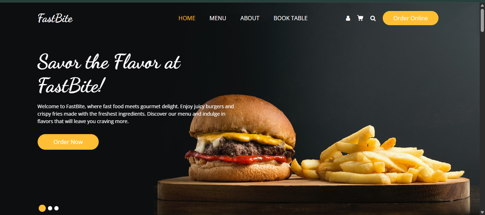

# Create a Web App using Container in Azure Portal 

## Overview

Azure App Service is a fully managed web application hosting platform. This platform as a service (PaaS) is offered by Azure. Azure App Service is actually a collection of four services, all of which are built to help you host and run web applications. Web Apps are the most commonly used of the four services. In this task, we will create a new web app that runs a Docker container.

## Task to be Done

1. Create a Web App
1. Test the Web App

## Task 1 : Create a Web App

1. Navigate to **Azure Portal** in search bar search for **App Service (1)** and select **App Service (2)**.

   

2. On App Service page, click on **+Create(1)**, choose **Web App(2)** from the dropdown menu.

    

3. In **Basics** tab, add the following information and click on **Next: Database > (9)**

   | **Settings**                    | **Values**                                               |
   |---------------------------------|----------------------------------------------------------|
   | Subscription                    | Select **Azure for Students (1)**                        |
   | Resource group                  | Select **webapp (2)** from dropdown menu                 |
   | Name                            | Provide a unique name e.g **DockerApp (3)**              |
   | Publish                         | **Select Container (4)**                                 |
   | Operating System                | **Select Linux (5)**                                     |
   | Region                          | Select  **West US 2 (6)** from the dropdown menu         |

   

   | **Settings**                    | **Values**                                                                             |
   |---------------------------------|----------------------------------------------------------------------------------------|
   | Linux Plan(West US 2)           | Select **(New) ASP-webapp-8312 (7)** from the dropdown menu                            |
   | Pricing Plan                    | Select **Basic B1(100 total ACU, 1.75 GB memory, 1 vCPU) (8)** from the dropdown menu  |

   

4. On the **Database** tab, leave everything as default, and click on **Next: Container>**.

5. On the **Container** tab, add the following information and click on **Review + Create (5)**

   | **Settings**                    | **Values**                                               |
   |---------------------------------|----------------------------------------------------------|
   | Image Source                    | **Select Other container registries (1)**                |
   | Access Type                     | **Select Public (2)**                                    |
   | Registry server URL             | **Keep it as default (3)**                               |
   | Image and tag                   | Enter **23mcc20042/fastbite (4)**                        |

   

6. Once the validation pass, click on **Create (1)**.
   
    
   
7. Wait a few minutes while Azure sets up your Web App. Click on the **Go to resource (1)** option.

   

## Task 2: Test the Web App

 1.  Now, you will be redirected to the newly created web app's page, Copy the **default domain (1)** URL 

       

 2.  Copy the URL and paste it into a new browser tab to observe the Web page.

      
   
   
   
