# Create a Function App using Azure Portal

## Overview

Azure Functions is a serverless solution that allows you to write less code, maintain less infrastructure, and save on costs. Instead of worrying about deploying and maintaining servers, the cloud infrastructure provides all the up-to-date resources needed to keep your applications running.

## Task to be Done

1. Create a Function App
1. Create a Blob triggered function 

## Task 1 : Create a Function App

1. On **Azure Portal page** in search bar search for **Function App(1)** and select **Function App(2)**.

   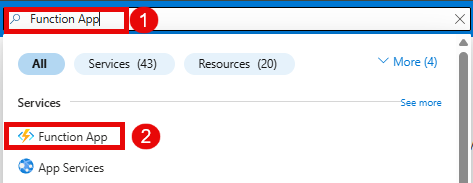

2. On App Service page, click on **+Create(1)**, choose **Function App(2)** from the dropdown menu.

   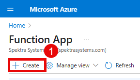

3. Choose Hosting plan as **Consumption(1)** then click on **Select(2)**.

   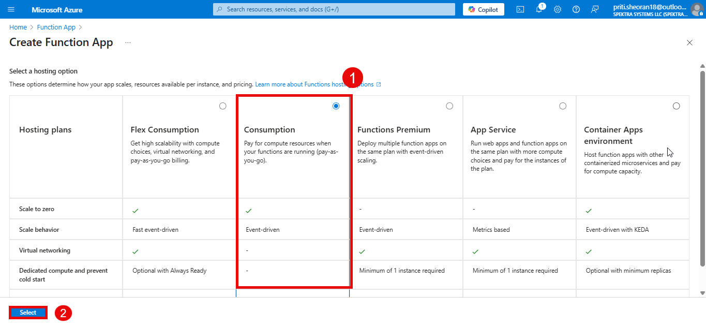

4. In **Basics** tab, add the following information and click on **Review + Create(8)**

   | **Settings**                    | **Values**                                               |
   |---------------------------------|----------------------------------------------------------|
   | Subscription                    | Select **Innova8 Training (1)**                          |
   | Resource group                  | Select **priti.sheoran18 (2)** from dropdown menu        |
   | Function App Name               | Provide a unique name e.g **practice122 (3)**            |
   | Operating System                | Select **Linux(4)**                                      |
   | Runtime stack                   | Select **Python (5)**  from the dropdown                 |
   | Version                         | Select  **3.11 (6)** from the dropdown menu              |
   | Region                          | Select a nearby region e,g. **Central US**               |

   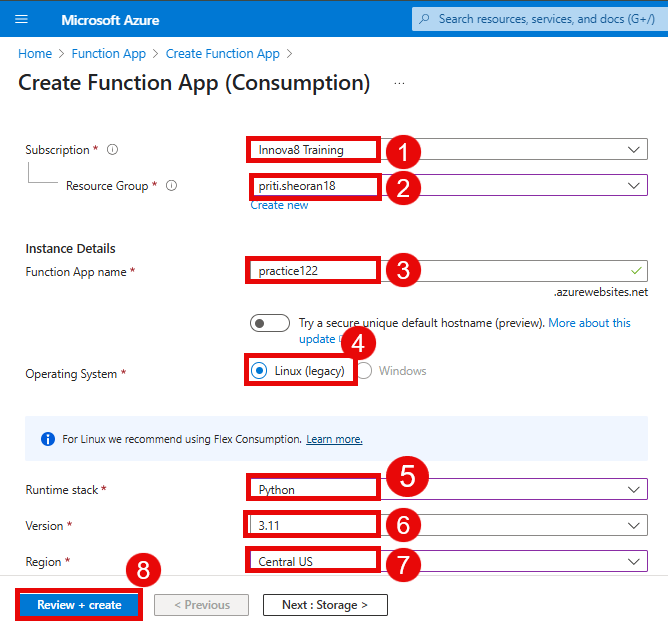

6. Once the validation pass, click on **Create(1)**.

   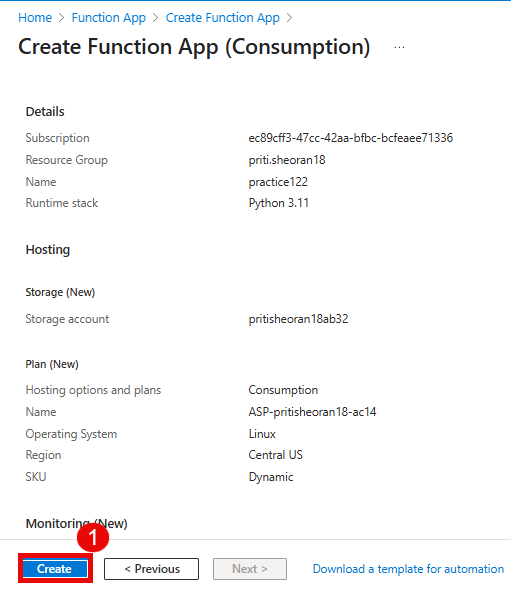 

7. Wait a few minutes while Azure sets up your Function App. Click on the **Go to resource(1)** option.

   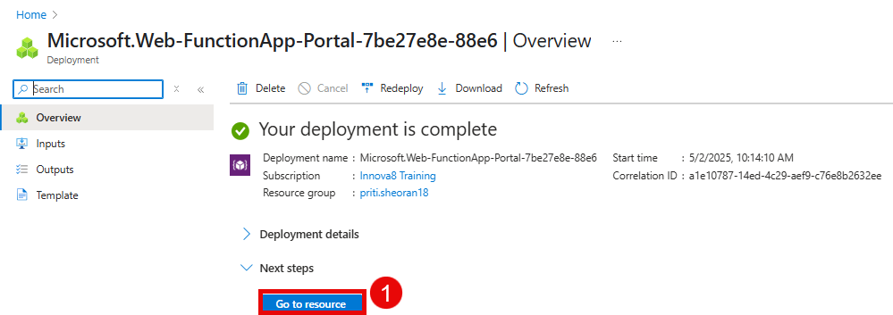
   
9. Navigate to **Storage Account** page, form the **Data Storage(1)** select **Container (2)**.  
    
   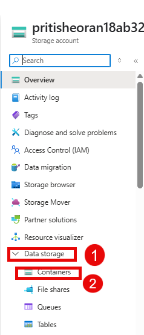

10. On the container page, select **+ Container(1)** to create a new container.

    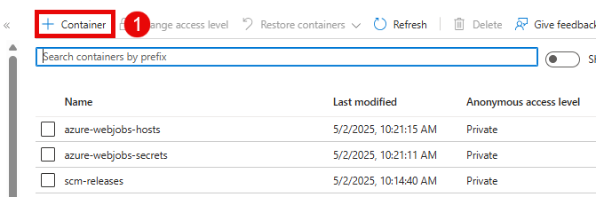

11. Create a **New Container** and click **Create(2)**.
    
    | **Settings**                    | **Values**                                               |
    |---------------------------------|----------------------------------------------------------|
    | Name                            |  **Provide a unique name (1)**                           |

    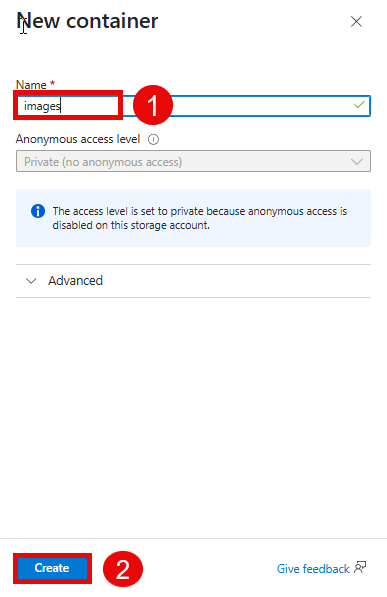    
   
## Task 2: Create a Blob triggered function 

1. On the **Overview(1)**, click **Create function(2)**.

   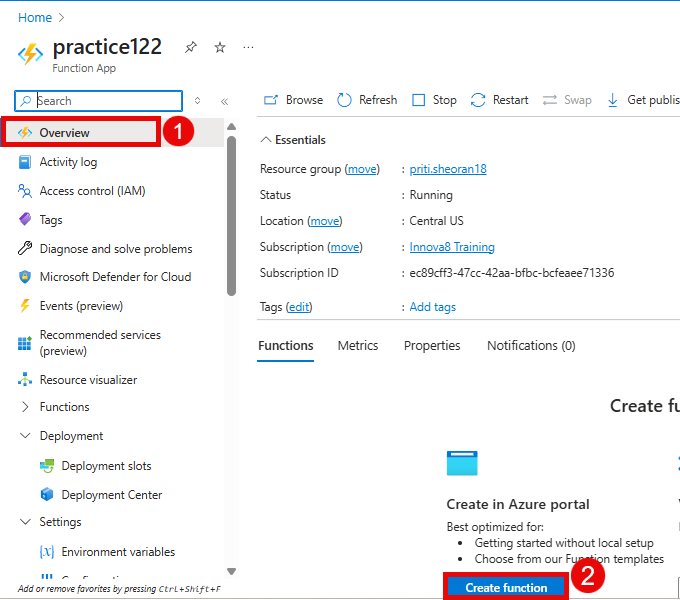
   
3. On the Select a template tab of the **Create function**, click on the **Blob trigger(1)** option and then click on **Next(2)**.

   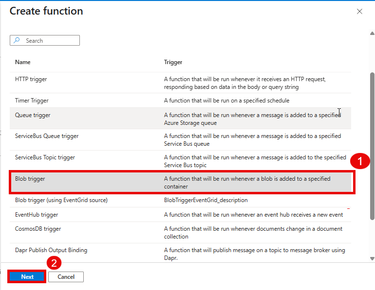
   
5. On the Template details tab and click on **Create(4)**.

   | **Settings**                    | **Values**                                                            |
   |---------------------------------|-----------------------------------------------------------------------|
   | Provide a function name         | Select **Default name or provide a unique name(1)**                   |
   | Path                            | Provide your container name **images(2)**                             |
   | Name                            | Select storage account name from New **pritisheoran18ab32 (3)**       |

   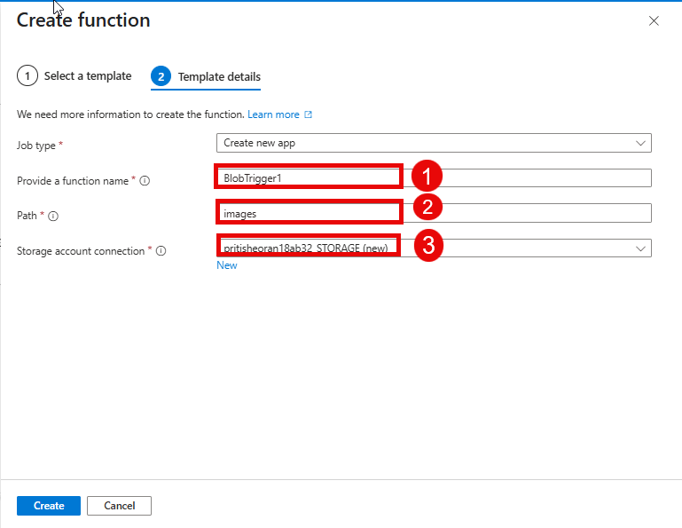
    
7. Navigate to Storage account, select **Upload (1)**, **browse for files (2)** and enter **Upload**.

   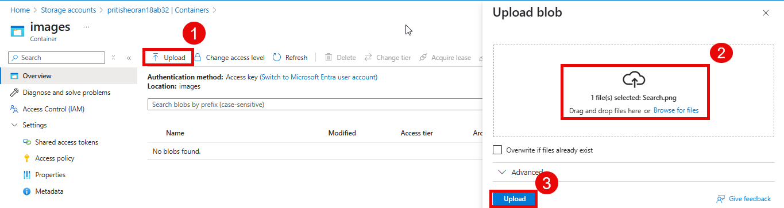
  
9. On the BlobTrigger1 > Code + Test, review the auto-generated code and note that the code is designed to run an Blob request and **log (1)** information.

   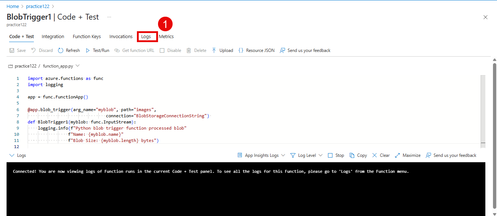
 
10. If you don't get the trigger in logs, then navigate to **integration (1)** inside the function **Azure blob storage (myblob)(2)** and check the **storage account connection (3)**.

    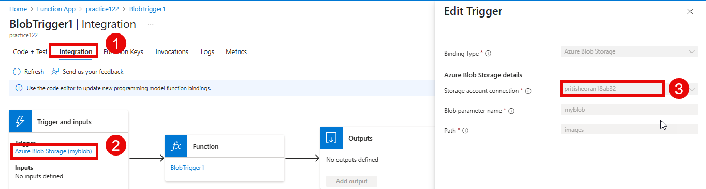

11. If not connected, we need to set the environmnet variables.
    
13. Navigate to the **storage account** > **security+ networking (1)** > **Access Keys (2)**, under Key1, copy the **connection string(3)**.

    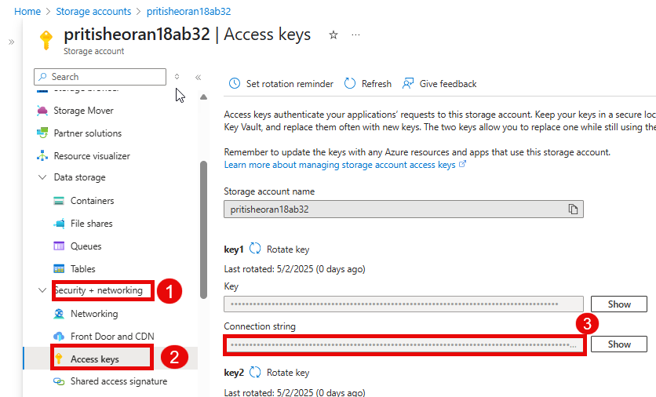

14. On the function app page, select **Environment Variable (1)** and click **+ Add (2)** to add the environment variable. 

    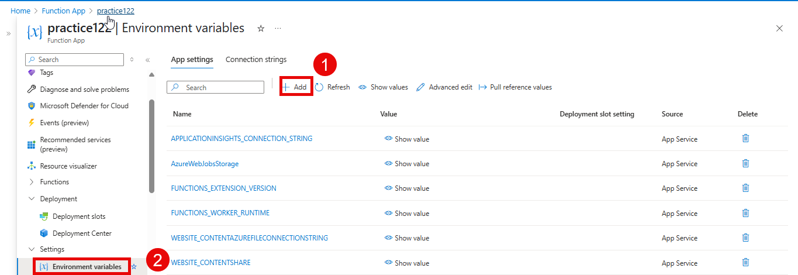  

15. Create an environment varable by adding the following information and click **Apply (3)**
    
    | **Settings**                    | **Values**                                                            |
    |---------------------------------|-----------------------------------------------------------------------|
    | Name                            |  **add the storage account name**                                     |
    | Value                           |  **Paste the copied connection string (2)** fron step (12)            |
   
    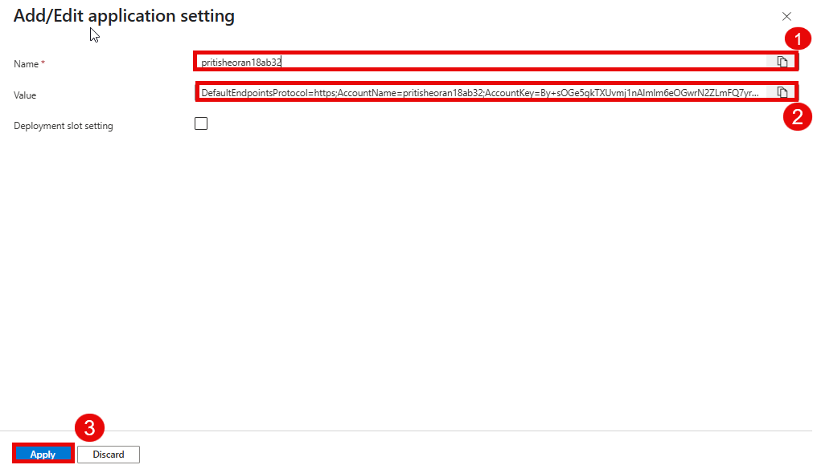
    
17. To add the environment click **Apply(1)**.

    
16. Now, upload an image inside the blob container and **it will trigger the Blob name and size (1)**. 
 
    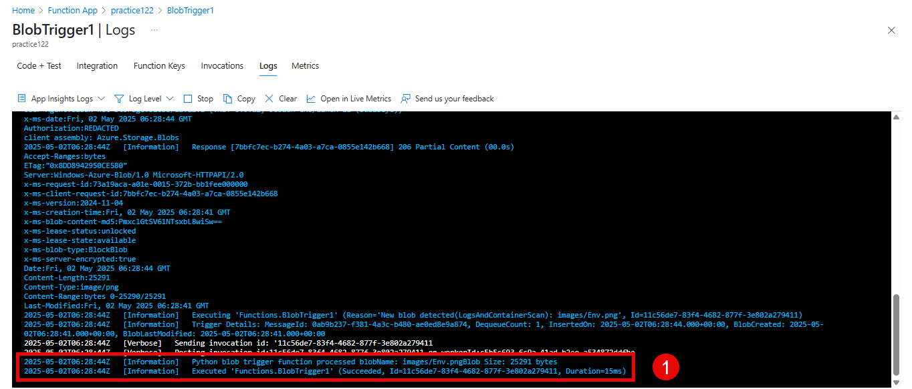

   

   

   
