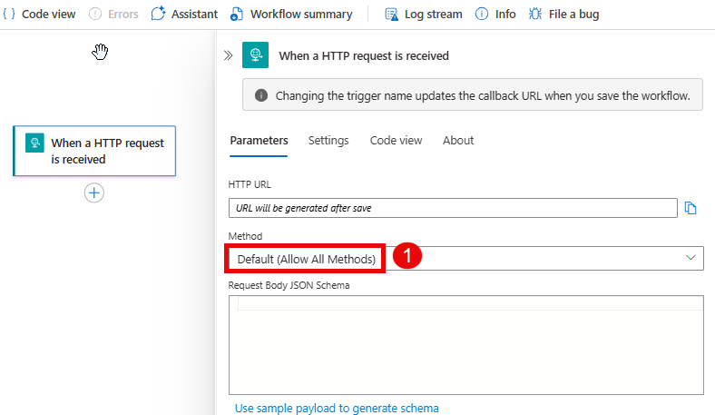
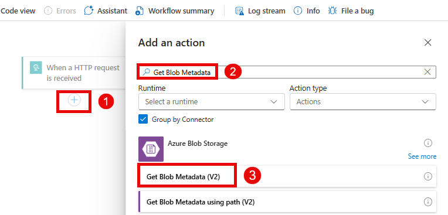
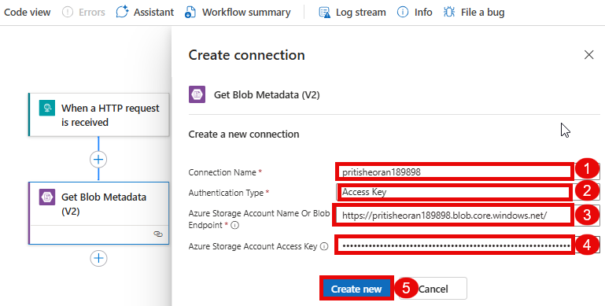
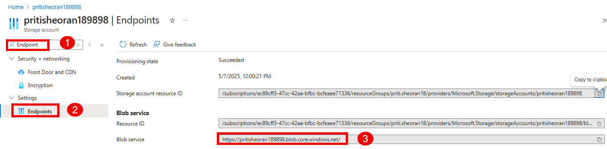
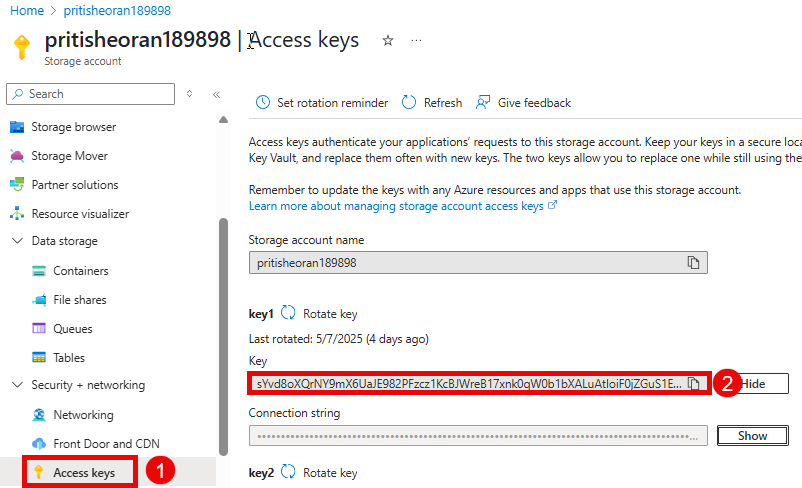

# Create a Logic App using Azure Portal

## Overview

Azure Logic Apps is a cloud platform where you can create and run automated workflows in, across, and outside the software ecosystems in your enterprise or organization. This platform greatly reduces or removes the need to write code when your workflows must connect and work with resources from different components, such as services, systems, apps, and data sources.

## Task to be Done

1. Create a Logic App
1. Create Workflow
3. Run Workflow

## Task 1 : Create a Logic App

1. On **Azure Portal page** in search bar search for **Logic App (1)** and select **Logic App (2)**.

   
   
3. On **Logic App page**, click on **+ Add (1)**.

   

4. On create logic app page, select a Hosting option as **Standard: Workflow Service Plan (1)** then click on **Select (2)**.

   
   
6. In **Basics** tab, add the following information and click on **Review + Create(8)**
   
   | **Settings**                    | **Values**                                                                                |
   |---------------------------------|-------------------------------------------------------------------------------------------|
   | Subscription                    | Select **Innova8 Training (1)**                                                           |
   | Resource group                  | Select **priti.sheoran18 (2)** from dropdown menu                                         |
   | Logic App Name                  | Provide a unique name e.g **Logic123434 (3)**                                             |
   | Region                          | Select a nearby region e,g. **West Europe (4)**                                           |
   | Windows Plan                    | Click **Create new** and provide name e.g. **Logic123434 (5)**                            |

   

   | **Settings**                    | **Values**                                                                                |
   |---------------------------------|-------------------------------------------------------------------------------------------|
   | Pricing Plan                    | Select **Workflow Standard WS1 (210 total ACU, 3.5 GB memory, 1 vCPU (6)** from dropdown  |
   | Zone Redundancy                 | Select **Disabled (7)**                                                                   |
   
   

8. Once the validation pass, click on **Create (1)**.

   
   
10. Wait a few minutes while Azure sets up your Logic App. Click on the **Go to resource** option.
    
    

## Task 2: Create Workflow 

1. Now, on newly created logic app's page, under workflows select **Workflows (1)**, select **+ Add (2)** to create a new workflow, enter the following information and click **Create (5)**.

   | **Settings**                    | **Values**                                                                                |
   |---------------------------------|-------------------------------------------------------------------------------------------|
   | Workflow Name                   | **Provide a unique name** for e.g. **First-logic (3)**                                    |
   | State type                      | Select **Stateless (4)**                                                                  |

   
  
2. On the **First-logic** workflow page, go to **Designer (1)** click on **Add a Trigger (2)** and select **Request (3)**.

   

3. On **add trigger** page, select the request type as **When a HTTP request is received (1)**.

   
    
5. **When a HTTP request is received**, select method as **GET (1)** from the dropdown menu and leave other settings as default.

   
   
7. Click on **(+) (1)** below the trigger, **Add action(2)** , in search bar search and select **Get Blob MetaData (3)**.

   

8. On **Create Connection** page, add the following information from already existing storage account and click **Create new (5)**.

   | **Settings**                     | **Values**                                                                                |
   |----------------------------------|-------------------------------------------------------------------------------------------|
   | Connection Name                  | Give Storage Account Name as connectiom name here, use **pritisheoran189898 (1)**         |
   | Authentication Type              | Select **Access key (2)** from dropdown menu                                              |
   | Blob endpoint                    | Provide **blob endpoint (3)**                                                             |
   | Azure Storage Account Access Key | Provide **Storage Account Access Key (4)**                                                |

   

   Note: if you don't know how to get the above mentioned details then follow the point 9 and 10.
   
1. Navigate to your storage account named **pritisheoran189898**, under **Settings** go to **Endpoints** and copy the **Blob service** endpoint in notepad.

  
    
1. Under security+networking got to **Access keys**  and copy the **Key** from key1 in notepad where you copied blob service endpoint.

  

9. On **Get Blob Metadata (V2)** page, provide **Blob Endpoint (1)** from the drop down menu and **Blob path (2)**.

    
   
1. Click on **(+) (1)** below the  **Get Blob Metadata (V2)**, **Add action(2)**, in search bar search and then, select **Check Whether Blob Exists**.

1. On **Create Connection** page, add the following information from already existing storage account and click **Create new (4)**.

   | **Settings**                      | **Values**                                                                                |
   |-----------------------------------|-------------------------------------------------------------------------------------------|
   | Connection Name                   | Give Storage Account Name as connectiom name here, use **pritisheoran189898 (1)**         |
   | Authentication Type               | Select **Storage account connection string(2)** from dropdown menu                        |
   | Storage Account Connection String | Provide **Storage Account Connection String (4)**                                         |

   Note: if you don't know how to get connection string, avigate to your storage account named **pritisheoran189898**, under security+networking select **Access keys** and from access keys page copy the **connection string** under key1.
   
3. On **Check whether blob exists** page, provide **Container name** as **images (1)** and **Blob Name** as **download.jpg (2)**.

4. Click on **(+) (1)** below the **Check whether blob exists**, **Add an action**, in search bar search and then, select **Condition (1)**.

   
6. On **Condition** page, select a parameter **Response from check blob exists action Is Blob Exists**, keep the value of the parameter as **True**.

   
8. Click on **(+) (1)** below the **True** condition, click on **Add an action**,in search bar search **Response** and then, select **Response (1)**.
   
1. Repeat **step 8** for False condition as well.
1. Under True condition click on **(+) (1)** below the **Response** action, click on **Add an action**,in search bar search **Outlook** and then, select **Send an email (v2) (1)**.
2. FOr True condition, on **Send an email (V2)** page, in parameters add the following information.
   
   | **Settings** | **Values**                                                                                |
   |--------------|-------------------------------------------------------------------------------------------|
   | TO           | provide a valid email e.g. **23mcc20042@cuchd.in (1)**                                    |
   | Subject      | Provide a subject e.g. **Check whether blob exists(2)**                                   |
   | Body         | Provide **Blob exists in your storage account pritisheoran189898 (3)**                    |
   
4. Repeat **step 8** for False condition as well.
5. FOr False conditon, on **Send an email (V2)** page, in parameters add the following information.
   
   | **Settings** | **Values**                                                                                |
   |--------------|-------------------------------------------------------------------------------------------|
   | TO           | provide a valid email e.g. **23mcc20042@cuchd.in (1)**                                    |
   | Subject      | Provide a subject e.g. **Check whether blob exists(2)**                                   |
   | Body         | Provide **Blob does not exist in your storage account pritisheoran189898 (3)**            |
   
7. Now your workflow is ready. Save and run it.
   
## Task 3: Run Workflow      
   

   
   

   
  
