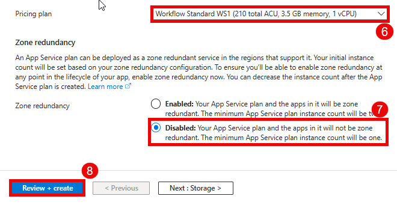

# Create a Logic App using Azure Portal

## Overview

Azure Logic Apps is a cloud platform where you can create and run automated workflows in, across, and outside the software ecosystems in your enterprise or organization. This platform greatly reduces or removes the need to write code when your workflows must connect and work with resources from different components, such as services, systems, apps, and data sources.

## Task to be Done

1. Create a Logic App
1. Create Workflow
3. Run Workflow

## Task 1 : Create a Logic App

1. On **Azure Portal page** in search bar search for **Logic App (1)** and select **Logic App (2)**.

   
   
3. On **Logic App page**, click on **+ Add (1)**.

   

4. On create logic app page, select a Hosting option as **Standard: Workflow Service Plan (1)** then click on **Select (2)**.

   
   
6. In **Basics** tab, add the following information and click on **Review + Create(8)**
   
   | **Settings**                    | **Values**                                                                                |
   |---------------------------------|-------------------------------------------------------------------------------------------|
   | Subscription                    | Select **Innova8 Training (1)**                                                           |
   | Resource group                  | Select **priti.sheoran18 (2)** from dropdown menu                                         |
   | Logic App Name                  | Provide a unique name e.g **Logic123434 (3)**                                             |
   | Region                          | Select a nearby region e,g. **West Europe (4)**                                           |
   | Windows Plan                    | Click **Create new** and provide name e.g. **Logic123434 (5)**                            |

   

   | **Settings**                    | **Values**                                                                                |
   |---------------------------------|-------------------------------------------------------------------------------------------|
   | Pricing Plan                    | Select **Workflow Standard WS1 (210 total ACU, 3.5 GB memory, 1 vCPU (6)** from dropdown  |
   | Zone Redundancy                 | Select **Disabled (7)**                                                                   |
   
   

8. Once the validation pass, click on **Create (1)**.

   
   
10. Wait a few minutes while Azure sets up your Logic App. Click on the **Go to resource(1)** option.
    
    

## Task 2: Create Workflow 

1. Now, on newly created logic app's page, under workflows select **Workflows (1)**, select **+ Add (2)** to create a new workflow, enter the following information and click **Create (5)**.

   | **Settings**                    | **Values**                                                                                |
   |---------------------------------|-------------------------------------------------------------------------------------------|
   | Workflow Name                   | **Provide a unique name** for e.g. **First-logic (3)**                                    |
   | State type                      | Select **Stateless (4)**                                                                  |

   
  
2. Inside the **First-logic** workflow page, click on **Add a Trigger (2)** and select **Request (3)**.

   

3. On **add trigger** page, select the request type as **When a HTTP request is received (1)**.

   
    
5. **When a HTTP request is received**, select method as **GET (1)** from the dropdown menu and leave other settings as default.
6. Click on **(+) (1)** below the trigger, **Add action(2)** then, in search bar search and select **Get Blob MetaData (3)**.
7. On **Create Connection** page, add the following information and click **  Create new (5)**.

   | **Settings**                     | **Values**                                                                                |
   |----------------------------------|-------------------------------------------------------------------------------------------|
   | Connection Name                  | Give Storage Account Name e.g. **pritisheoran189898 (1)** as connectiom name              |
   | Authentication Type              | Select **Access key (2)** from dropdown menu                                              |
   | Blob endpoint                    | Provide **blob endpoint (3)**                                                             |
   | Azure Storage Account Access Key | Provide **Storage Account Access Key (4)**                                                |

8. A new page **Get Blob Metadata (V)** page, provide **Blob Endpoint (1)** from the drop down menu and **Blob path(2)**.
9. 
   
   

   
  
