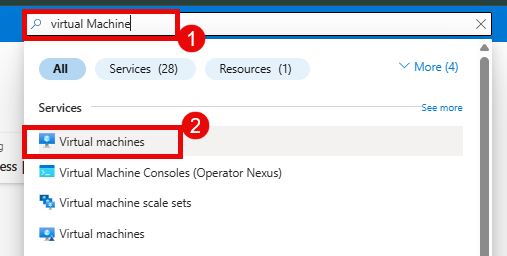
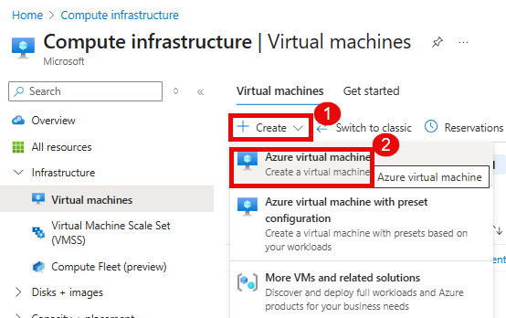
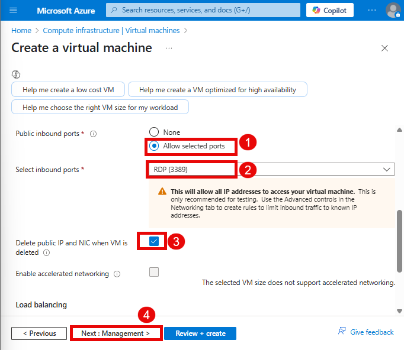
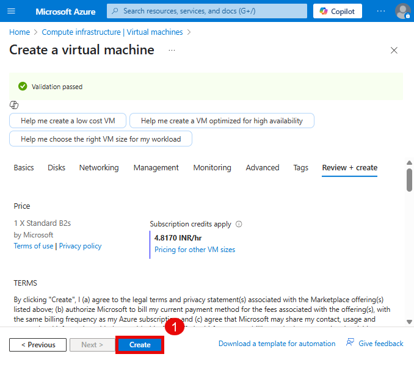
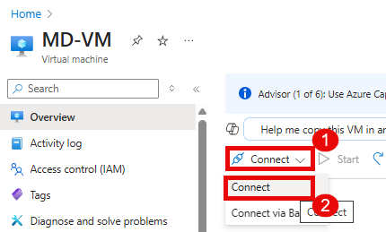
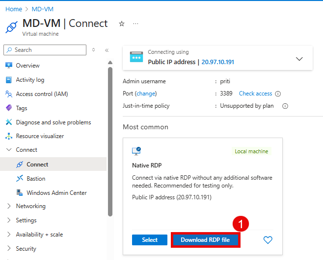
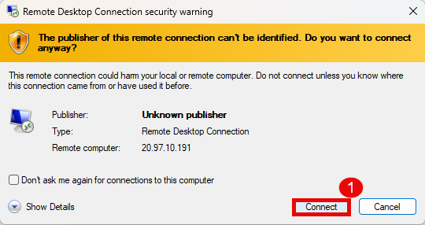
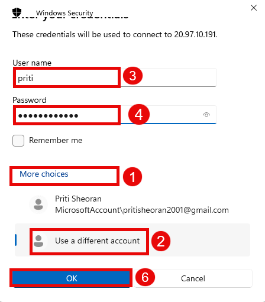

# Create a Virtual Machine using Azure Portal

An Azure virtual machine (VM) is a computing resource provided by Microsoft Azure. It allows users to create and use virtualized computing instances in the cloud. Azure Virtual Machines enable users to run applications, host websites, and perform various computing tasks without needing to purchase and maintain physical hardware.

---

## Task to be Done

1. Create a Virtual Machine
1. Connect to Virtual Machine

---

## Task 1 : 

- Go to azure portal in search bar search for **Virtual Machine**. 

  

- Click on **+Create**, choose **Azure Virtual Machine**.
 
  

- In **Basics** tab, add the following information.

| **Settings**                     | **Values**                                                |
|----------------------------------|-----------------------------------------------------------|
| Subscription                    | Accept default subscription                                |
| Resource group                  | priti                                                 |
| Virtual machine name            | MD-VM                                                       |
| Region                          | Select the nearest one                                                   |
| Availability options            | No infrastructure redundancy required                      |
| Image                           | Windows Server 2019 Datacenter - x64 Gen2                  |
| Size                            | Standard B2s                                            |

  

- In **Disk** Tab, choose the following values and click **next: Networking**

  

- In **Networking** tab, **Virtual Network**, **Subnet**, **Public IP**, **NIC Network security group** leave these as default only **Select inbound ports** and **Enable Delete public IP and NIC when VM is deleted**.
Click **Next: Management**

  

- Leave the remaining as default and then click on the Review + create button at the bottom of the page.

- Click **Review + Create**, Azure validates your configuration.
- Click **Create** to start the deployment

  

- Wait a few minutes while Azure sets up your Virtual Machine

  

---

## Task 2: Connect to the VM

Once deployed:

- Click on the **Go to resource** option. You will be redirected to the newly created virtual machine's page.

  

- Click **Connect > RDP** and download the RDP file and open it.

  

- Open the downloaded RDP file and click Connect when prompted.

   

- Enter your credentials and you should be able to connect to VM successfully.

  

---

